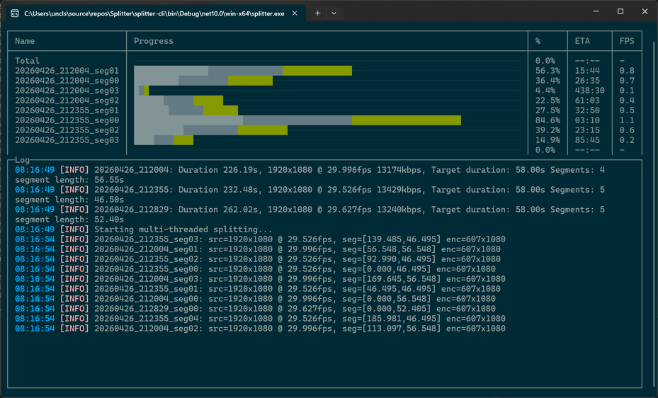
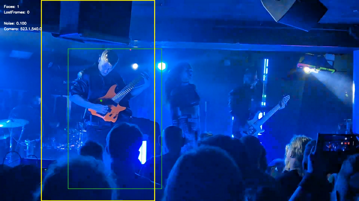

# Splitter

Splitter is a high‑performance command line tool for cutting one or more video files into equal or fixed‑length segments using multi‑threaded FFmpeg execution.  
It supports batch input, flexible duration formats, rotation, smart face/body‑aware cropping, ETA and speed reporting, and both rich and plain‑text terminal output.



## Features

- Multi‑threaded FFmpeg splitting for maximum throughput  
- Equal or fixed‑length segmentation  
- Batch input via file masks or list files  
- Smart cropping with face/body tracking  
- Rotation correction  
- ETA, speed, and progress display  
- FFmpeg passthrough for advanced control  
- [Potentially] Cross‑platform (.NET 10)

## Requirements

- FFmpeg and FFprobe available in system PATH  
- .NET 10 Runtime or newer  

If you want to update model:

- For face detection: [opencv_zoo/models/face_detection_yunet at main · opencv/opencv_zoo](https://github.com/opencv/opencv_zoo/tree/main/models/face_detection_yunet)
- For body detection: [yolov8s.pt · Ultralytics/YOLOv8 at main](https://huggingface.co/Ultralytics/YOLOv8/blob/main/yolov8s.pt)

To convert models from PyTorch to ONNX, you can use the following command:

```python
from ultralytics import YOLO

model = YOLO("yolov8x.pt")
model.export(format="onnx", opset=12, half=False)   # FP32 ONNX
```

## How It Works

1. Reads total duration using ffprobe  
2. Parses target duration  
3. Computes number of segments  
4. If not forced, equalizes segment lengths  
5. Runs multiple FFmpeg processes in parallel  
6. Applies rotation, crop, and tracking if enabled  
7. Displays progress, ETA, and speed  

---
## Face Tracking vs Body Tracking

Face tracking and body tracking serve different purposes, and Splitter supports both because each 
excels in different recording environments. When converting horizontal footage into vertical clips, 
the choice of detector determines how stable, reliable, and natural the automated camera motion will be.



### Face Tracking Using UltraFace 320

Splitter uses the UltraFace 320 ONNX model to perform lightweight, real‑time face detection on each 
frame of the input video. The detector produces bounding boxes for visible faces, and the tracking 
system maintains a stable, smoothed target region across time. This is achieved by combining per‑frame
detections with temporal smoothing (EMA), dropout tolerance, and camera easing. The result is a 
continuous, stable crop window that follows the performer even when the face is partially occluded,
briefly lost, or moving rapidly.

During segmentation, the crop window is recalculated for every frame, ensuring that each output 
segment inherits the same smooth camera motion. This makes the vertical clips appear as if they 
were recorded with a dedicated portrait‑oriented camera operator. The UltraFace 320 model is 
fast enough to run alongside multi‑threaded FFmpeg splitting without becoming a bottleneck, 
making it suitable for long recordings and batch processing.

### Benefits of Full‑Body Detection Using YOLOv8s for Live Gig Recordings

When recording concerts or live gigs, performers often move unpredictably, turn away from the 
camera, or become partially obscured by lighting, instruments, or stage effects. 
Full‑body detection using a YOLOv8s ONNX model provides a more reliable tracking anchor than 
face detection alone. Because YOLOv8s can detect the entire human silhouette, the tracker
maintains stable framing even when the face is not visible, when the performer is far from 
the camera, or when stage lighting makes facial features hard to detect. This produces vertical 
clips that feel intentional and professionally framed, with fewer sudden jumps or lost‑tracking
moments. For creators converting horizontal gig footage into short vertical clips for YouTube 
Shorts or TikTok, body‑based tracking significantly improves consistency, reduces manual editing, 
and preserves the energy and motion of the performance.

### Automated Camera Control

Splitter includes an automated camera control system that simulates the behavior of a virtual 
camera operator when generating vertical crops from horizontal footage. The goal is to maintain 
smooth, intentional framing around the tracked subject, even when detections are noisy, intermittent,
or temporarily lost.

The controller receives object detections (face or body) and converts them into a stable crop 
window using a combination of Kalman filtering, exponential smoothing, dropout tolerance, 
and a three‑state tracking model. The Kalman filter provides predictive motion smoothing, 
while the EMA factor blends the predicted position with the previous camera center to avoid jitter. 
The camera easing value controls how quickly the virtual camera follows the subject, producing 
natural‑looking motion rather than abrupt jumps.

When detections disappear, the controller enters one of two fallback modes. In LostFreeze mode, 
the camera holds its last known position for a configurable number of frames, preventing sudden 
jumps during brief occlusions. If the subject remains lost beyond that threshold, the controller 
transitions to LostDrift mode, slowly drifting the camera back toward a neutral center position. 
This prevents the crop from drifting off‑screen and ensures that the output remains usable even 
when tracking fails. All positions are clamped to valid bounds, guaranteeing that the crop window
never leaves the video frame.

---

## Usage

```
splitter [<input.mp4> ...] [options] [--] <ffmpeg passthrough>
```

Inputs may be provided directly, via `--file=...`, or using file masks such as `videos/*.mp4`.

---

## Options

Below is a clean, ASCII‑only **options table** version of your content.  
All option names are preserved exactly, and descriptions are consolidated for clarity.

---

## Options

| Option | Description |
|--------|-------------|
| **--out=<folder>** | Output folder for generated segments. Default: `<input folder>/Splitter`. |
| **--file=<path>** | Input file list or file mask. If omitted, the first non‑option argument is used as input. Examples: `--file=videos/*.mp4`, `--file=file_list.txt`. |
| **--mask=<pattern>** | Custom output filename pattern. Default: `[NAME]_seg[NN].[EXT]`. Supports `[NAME]`, `[N]`, `[NN]`, `[NNN]`, `[NNNN]`, `[EXT]`. Example: `--mask="[NAME]_[NNNN].mp4"`. |
| **--duration=<value>** | Override target segment duration. Formats: `Ns`, `NmMs`, `N`. Examples: `--duration=90s`, `--duration=2m30s`, `--duration=45`. Without `--force`: max 58 seconds, equalized across segments. |
| **--force** | Use the duration exactly as provided. Last segment may be shorter. |
| **--rotate=<degrees>** | Rotate video by 90, 180, or 270 degrees. Useful for correcting orientation metadata. |
| **--estimate** | Print calculated segment information and exit. No splitting is performed. |
| **--crop[=<w:h>]** | Crop video to a target width and height with face/body tracking. Default: 607x1080. Ideal for Shorts, TikTok, Reels. |
| **--detect=<name>** | Object detector for tracking. Values: `face` (UltraFace), `body` (YoloOnnx, default), `none` (center crop). |
| **--gravitate=<x:y>** | Bias the crop window toward a normalized point in the frame. Example: `--gravitate=0.2:0.5`. |
| **--text** | Use plain‑text logging instead of the rich terminal UI. |
| **--single-thread** | Disable parallel FFmpeg execution. Useful for debugging or low‑resource systems. |
| **--debug** | Show debug overlay during tracking. No cropping performed, but crop region shown. |
| **-p:<name>=<value>** | Set custom parameters for the object detector. Example: `-p:confidence=0.5`. Defaults: DropoutToleranceFrames=20, EmaFactor=0.65, CameraEasing=0.03, LostFreezeFrames=60. |

---

## FFmpeg Passthrough

Anything after `--` is passed directly to FFmpeg.

Example:
```
splitter video.mp4 --force --duration=45 -- -an -sn
```

---

## Input and Output Behavior

- `input.mp4` may be a file mask (`videos/*.mp4`)  
- Output filenames follow the `--mask` pattern  
- Output folder defaults to `<input folder>/Splitter` unless overridden

---

## Examples

Split into equal 60‑second segments:
```
splitter vertical-video.mp4
```

Split into equal 90‑second segments:
```
splitter vertical-video.mp4 --duration=90s
```

Custom naming:
```
splitter vertical-video.mp4 --duration=2m30s --mask="[NAME]_[NNNN].mp4"
```

Estimate only:
```
splitter vertical-video.mp4 --estimate
```

Fixed 45‑second segments with passthrough:
```
splitter vertical-video.mp4 --force --duration=45 -- -an -sn
```

Smart crop for Shorts:
```
splitter horizontal-video.mp4 --out=Cropped/ --crop
```

Batch processing with body tracking:
```
splitter --file=file_names.txt --out=Cropped/ --crop --detect=body
```

