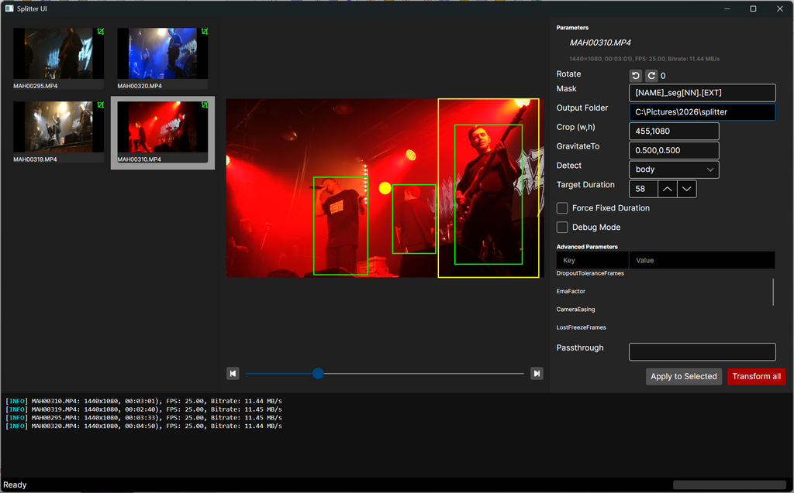

# Splitter-UI

A compact, modern desktop front-end for Splitter (the high-performance FFmpeg-based video splitter). Built with Avalonia 12 and 
targeting .NET 10, this project provides a native-feeling cross-platform UI to configure splitting jobs, preview smart 
crops, and drive the Splitter CLI backend.

## Overview

Splitter-UI wraps the core Splitter pipeline (the referenced splitter-cli project) and exposes common workflow tasks 
through an accessible interface: input selection, output naming, duration and crop controls, rotation options, detector settings, 
and a job monitor with progress and ETA. For the full command-line feature set and the implementation rationale, see the 
repository root README (../README.md).

## Screenshots

## Getting started

Requirements: .NET 10 runtime and FFmpeg/FFprobe available on PATH. The UI references the splitter-cli project; 
build the solution to ensure the CLI is available to the UI during development.

To build and run locally:

1. From the solution root run: dotnet build
2. Start the UI project: dotnet run --project Splitter-UI

## Packaging

The csproj is configured for a win-x64 self-contained runtime identifier. Use dotnet publish with the desired 
configuration and runtime identifier to produce distributable artifacts.

## Configuration

Settings exposed in the UI map closely to the CLI options: output folder, filename mask, segment duration and 
force mode, rotation, crop and detector choices, gravitation bias and detector parameters. Advanced passthrough 
arguments can still be supplied to FFmpeg via the CLI passthrough field.

## Developer notes

- Project: Splitter-UI (Avalonia 12, net10.0)
- Key packages: Avalonia, Avalonia.Controls.DataGrid, Avalonia.Desktop, Avalonia.Themes.Fluent, CommunityToolkit.Mvvm
- The UI project references the splitter-cli project for tight integration during development.

## Troubleshooting

If FFmpeg or FFprobe are not found, the app will be unable to probe media or run splits. Verify tools are on the 
system PATH and that the runtime matches the built RID.

## Contributing and License

Contributions follow the main repository guidelines. See the root README for contributor and license information.

## Contact

For issues or questions, open an issue on the project repository or contact the 
maintainer listed in the main README.
